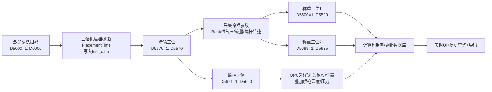
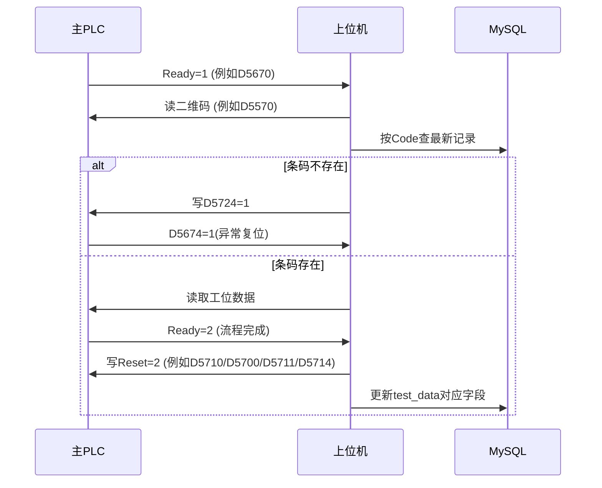

# Inkjet_Print_Tester

## 项目概览

本项目是喷银工艺测试上位机（WinForms），负责以下核心职责：

- 与主 PLC、清洗机 PLC、喷枪控制器、OPC UA 服务器通信
- 按工位采集并汇总二维码对应的全流程数据
- 实时判定 OK/NG，记录报警与日志
- 将数据落库（MySQL + Dapper）并支持导出

## 架构与模块

### 主工程

- `Inkjet_Print_View`: UI + 工位流程编排（`FrmMain`）

### 数据层

- `PR_DAL`: `TestDataDal`、`PLCAlarmDal`、`TestProjectDal` 等
- `PR_Model`: `TestData`、`TestDataQuery`、`PLCAlarm` 等实体

### 通信层

- 主 PLC: `MecPlcHelper`（三菱 MC 协议）
- 清洗机 PLC: `PlcClearHelper`
- 喷枪 TCP: `TcpClientHelper`
- 监控 OPC: `HiWatchOpcMonitor`

### 其他

- `PR_Helper`: 配置、日志、通用工具
- `HslAuth`: HslCommunication 授权

## 设备交互总览

系统有 7 条常驻线程并行运行：

- `PlcClearAction`: 激光清洗扫码建档
- `PlcHeavyAction`: 称重1采集
- `PlcHeavyAction2`: 称重2采集
- `PlcColdSprayAction`: 冷喷采集
- `PlcMonitorAction`: 监控采集（OPC）
- `WritePLCTemperature` / `WritePLCTemperature2`: 比对与喷枪温压回写
- `ReadPLCAlarm`: 报警扫描

此外有两类心跳线程：

- 主 PLC 心跳：`D5750` 每秒 1/0 翻转
- 清洗机 PLC 心跳：`D5003` 每秒 1/0 翻转

## 上位机与 PLC 握手协议

大多数工位遵循统一握手模式：

1. PLC 将某 Ready 点写为 `1`，表示数据可读
2. 上位机读取二维码并采集相关数据
3. 上位机等待 PLC 将 Ready 点写为 `2`（流程完成）
4. 上位机写对应 Reset 点为 `2`，通知本次交互结束

异常分支（条码不存在）统一处理：

- 上位机写 `D5724 = 1`（无条码/数据库无记录）
- 等待 `D5674 == 1`（PLC 侧异常复位确认）

## 工位业务流转（详细）

### 1) 激光清洗工位（建档入口）

- 触发条件：清洗机 PLC `D5000 == 1`
- 上位机读取二维码：`D6000`
- 构造 `TestData` 初始记录：
   - `Code = 二维码`
   - `PlacementTime = DateTime.Now`
   - 从 `TestProject` 加载各监控上下限（温度、浓度、速度、氮压、进气压等）
- 落库：`TestDataDal.addNew`
   - 若该条码已存在，仅刷新 `PlacementTime`
- 回写结果：
   - 成功 `D5001 = 1`
   - 失败 `D5001 = 2`

### 2) 冷喷工位

- 触发条件：主 PLC `D5670 == 1`
- 读取二维码：`D5570`
- 用二维码查询最新 `TestData`
- 采集内容：
   - 进气压力 `D5518`
   - 进气流量 `D5696`
   - 粉罐切换状态 `D5672`
   - 螺杆转速来自喷枪 TCP（`floatArray[5]` 或 `floatArray[6]`，由 `D5672` 决定）
- 流程完成条件：等待 `D5670 == 2`
- 节拍计算：
   - `Beat = Round((EndTime - StartTime).TotalSeconds, 2)`
   - `Beat <= 0` 时兜底为 `0.01`
- 冷喷收尾：
   - 上位机写 `D5710 = 2`（`ResetColdSprayReady`）
   - 更新数据库 `UpColdSpraydate`

### 3) 监控工位（OPC 采样）

- 触发条件：`D5671 == 1`
- 读取二维码：`D5620`
- 建立 OPC UA 连接（`MonitorIP`），订阅 3 个节点：
   - `ns=2;s=Sensor_00.CurrentMean.ParticleSpeed`
   - `ns=2;s=Sensor_00.CurrentMean.ParticleDensity`
   - `ns=2;s=Sensor_00.CurrentMean.SprayPos`
- 数据融合：
   - OPC 提供速度/浓度/位置
   - 温度/氮压来自喷枪 TCP 线程共享值（非 OPC 节点）
- 流程完成条件：等待 `D5671 == 2`
- 统计处理：
   - 前后各裁剪 15 个样本（样本不足不裁剪）
   - 计算均值、极值、标准差
   - 判定平均值/最小值上下限，汇总 `SpeedResult`、`ConcentrationResult`、`TemperatureResult`、`NitrogenPressureResult`
- 监控收尾：
   - 上位机写 `D5711 = 2`
   - 更新数据库 `UpMonitordate`
   - 导出 CSV 与散点图

### 4) 称重1工位

- 触发条件：`D5500 == 1`
- 读取二维码：`D5520`
- 读取称重数据（示例）：
   - 喷前/喷后/沉积重量：`D5502`、`D5504`、`D5506`
   - 重量上/下限：`D5508`、`D5510`
   - 结果位：`D5512`
   - 供粉速度/喷嘴高度：`D5677`、`D5678`
   - 多时刻重量点：`D5679`~`D5693`
- 计算银粉利用率：
   - `denominator = PowderSupplySpeed / 60 * Beat`
   - `UtilizationRate = SedimentationWeight / denominator`
   - 分母 <= 0 或结果非法（NaN/Inf）时写 `0%`
- 收尾：
   - 上位机写 `D5700 = 2`
   - 更新数据库 `UpHeavydate`

### 5) 称重2工位

- 触发条件：`D5699 == 1`
- 读取二维码：`D5935`
- 读取称重2数据：
   - 主要寄存器 `D5970`~`D5992`
   - 部分参数与工位1共用（如 `D5508`、`D5510`、`D5677`、`D5678`）
- 利用率计算与工位1相同
- 收尾：
   - 上位机写 `D5714 = 2`
   - 更新数据库 `UpHeavydate`

### 6) 比对与超时判定（对比1/对比2）

- 对比1触发：`D5676 == 1`，读取条码 `D5850`
- 对比2触发：`D5698 == 1`，读取条码 `D5900`
- 对比逻辑：
   - 查数据库 `PlacementTime`
   - 与当前时间比较（配置 `PlacementTimeout` 小时）
   - 写回超时判定：
      - 对比1写 `D5712`: 1=正常, 2=超时, 3=数据库无条码
      - 对比2写 `D5713`: 1=正常, 2=超时, 3=数据库无条码
- 同线程持续读取喷枪并回写：
   - 温度 `D5732`
   - 压力 `D5730`

### 7) 报警线程

- 扫描范围：`D5800`~`D5837`
- 报警值 `1` 时写入 `PLCAlarm` 并更新界面
- 字典 `alarmDictionary` 完成点位到中文报警文本映射

## PLC 点位明细（按功能）

### 主 PLC（MecPlcHelper）

| 功能 | 点位 | 方向 | 说明 |
|---|---|---|---|
| 称重1 Ready | D5500 | PLC->PC | 1=可读，2=流程完成 |
| 称重2 Ready | D5699 | PLC->PC | 1=可读，2=流程完成 |
| 冷喷 Ready | D5670 | PLC->PC | 1=可读，2=流程完成 |
| 监控 Ready | D5671 | PLC->PC | 1=可读，2=流程完成 |
| 称重1 Reset | D5700 | PC->PLC | 上位机写2 |
| 称重2 Reset | D5714 | PC->PLC | 上位机写2 |
| 冷喷 Reset | D5710 | PC->PLC | 上位机写2 |
| 监控 Reset | D5711 | PC->PLC | 上位机写2 |
| 异常复位确认 | D5674 | PLC->PC | 1=异常已复位 |
| 数据库无条码 | D5724 | PC->PLC | 1=无条码 |
| 对比1状态回写 | D5712 | PC->PLC | 1正常/2超时/3无条码 |
| 对比2状态回写 | D5713 | PC->PLC | 1正常/2超时/3无条码 |
| 对比1触发 | D5676 | PLC->PC | 1=触发 |
| 对比2触发 | D5698 | PLC->PC | 1=触发 |
| 切换粉罐 | D5672 | PLC->PC | 1/2 |
| 进气压力 | D5518 | PLC->PC | float |
| 进气流量 | D5696 | PLC->PC | float |
| 供粉速度 | D5677 | PLC->PC | int16/10 |
| 喷嘴高度 | D5678 | PLC->PC | int16/10 |
| 温度回写 | D5732 | PC->PLC | float |
| 压力回写 | D5730 | PC->PLC | float |
| 主PLC心跳 | D5750 | PC->PLC | 1/0 翻转 |
| PLC心跳读取 | D5673 | PLC->PC | 心跳状态 |
| PLC心跳复位 | D7139 | PC->PLC | 写0 |

### 条码点位

| 工位 | 点位 | 说明 |
|---|---|---|
| 冷喷 | D5570 | 长度49 |
| 监控 | D5620 | 长度49 |
| 称重1 | D5520 | 长度49 |
| 称重2 | D5935 | 长度34 |
| 对比1 | D5850 | 长度49 |
| 对比2 | D5900 | 长度34 |

### 清洗机 PLC（PlcClearHelper）

| 功能 | 点位 | 方向 | 说明 |
|---|---|---|---|
| 清洗 Ready | D5000 | PLC->PC | 1=可读 |
| 清洗条码 | D6000 | PLC->PC | 长度50 |
| 新增结果 | D5001 | PC->PLC | 1成功/2失败 |
| 清洗心跳 | D5003 | PC->PLC | 1/0 翻转 |

## 工件与数据流转图（Mermaid）

## 上位机与主 PLC 时序图（Mermaid）

## 编译运行

- 打开 `Inkjet_Print_View.sln`，使用 Visual Studio 编译运行
- 或在仓库根目录执行 `msbuild /t:build`

## 备注

- 利用率依赖 `Beat`（冷喷节拍），冷喷未完成或节拍异常会直接影响称重结果
- 监控统计依赖 OPC 采样时长，样本过少会触发“跳过前后裁剪”分支

## 数据库表结构（概览）
下面列出代码中使用到的主要表及字段（根据 `PR_Model` 实体与 `PR_DAL` 的 SQL 语句推断，类型为建议的 MySQL 映射）：

### `test_data`
- `ID` : INT PRIMARY KEY 自增 — 主键
- `Code` : VARCHAR(255) — 条码（QR-Code）
- `PreSprayWeight`, `PreSprayWeight_1`, `PreSprayWeight_1_5`, `PreSprayWeight_2`, `PreSprayWeight_2_5` : FLOAT — 喷前不同时间点重量
- `PostSprayWeight`, `PostSprayWeight_1`, `PostSprayWeight_1_5`, `PostSprayWeight_2`, `PostSprayWeight_2_5` : FLOAT — 喷后不同时间点重量
- `Location` : VARCHAR(100) — 喷淋/测试位置
- `SedimentationWeight` : FLOAT — 沉积重量
- `WeightUpperLimit`, `WeightLowerLimit` : FLOAT — 重量上下限
- `WeightResult` : VARCHAR(32) — 重量判定（0:待检测/1:OK/2:NG）
- `AddTime` : DATETIME — 建档/称重时间
- `UtilizationRate` : VARCHAR(32) — 银粉利用率（文本/百分比）
- 温度相关：
   - `AverageTemperature`, `MinTemperature`, `MaxTemperature` : FLOAT
   - `AverageTemperatureUpperLimit`, `AverageTemperatureLowerLimit`, `MinTemperatureLowerLimit` : FLOAT
   - `AverageTemperatureResult`, `MinTemperatureResult`, `TemperatureResult` : VARCHAR(32)
- 氮气压力相关：
   - `AverageNitrogenPressure`, `MinNitrogenPressure`, `MaxNitrogenPressure` : FLOAT
   - `AverageNitrogenPressureUpperLimit`, `AverageNitrogenPressureLowerLimit`, `MinNitrogenPressureLowerLimit` : FLOAT
   - `AverageNitrogenPressureResult`, `MinNitrogenPressureResult`, `NitrogenPressureResult` : VARCHAR(32)
- `PowderSupplySpeed` : FLOAT — 供粉速度
- 冷喷时间相关：
   - `StartTime`, `EndTime` : DATETIME — 冷喷启动/停止时间
   - `Beat` : FLOAT — 节拍（秒）
- `PlacementTime` : DATETIME — 激光清洗后摆放时间（建档时间）
- `PlacementHour` : VARCHAR(32) — 摆放时长（以字符串形式 hh:mm）
- 设备/过程参数：
   - `ThreadRotation` : FLOAT — 螺杆转速
   - `IntakePressure` : FLOAT — 进气压力
   - `IntakePressureLowerLimit` : FLOAT
   - `IntakePressureResult` : VARCHAR(32)
   - `IntakeFlow` : DOUBLE — 进气流量
   - `NozzleHeight` : FLOAT — 喷嘴高度
- 速度/浓度/位置统计（监控工位的 OPC/融合结果）：
   - `AverageSpeed`, `MaxSpeed`, `MinSpeed`, `StdDevSpeed` : DOUBLE
   - `AverageSpeedUpperLimit`, `AverageSpeedLowerLimit`, `MinSpeedLowerLimit` : DOUBLE
   - `AverageSpeedResult`, `MinSpeedResult`, `SpeedResult` : VARCHAR(32)
   - `AverageConcentration`, `MaxConcentration`, `MinConcentration`, `StdDevConcentration` : DOUBLE
   - `AverageConcentrationUpperLimit`, `AverageConcentrationLowerLimit` : DOUBLE
   - `AverageConcentrationResult`, `ConcentrationResult` : VARCHAR(32)
   - `AveragePosition`, `MaxPosition`, `MinPosition`, `StdDevPosition` : DOUBLE

(说明) `test_data` 是主表，记录从清洗建档到称重/监控/冷喷全部字段；代码里既有 `insert into test_data(...)` 也有针对单条记录的 `update test_data set ... where ID=...`，因此当前逻辑会在存在记录时更新字段而非追加新行。

### `alarm_statistics`
- `ID` : INT PRIMARY KEY — 主键
- `AlarmMessage` : TEXT/VARCHAR(512) — 报警文本
- `AddTime` : DATETIME — 报警发生时间

### `SysLog`（系统日志）
- `ID` : INT PRIMARY KEY
- `UserName` : VARCHAR(128)
- `Content` : TEXT — 日志内容
- `LogType` : INT — 日志类型枚举（代码中为 `LogMsgType`）
- `AddTime` : DATETIME — 日志时间

### `sysuser` / `SysUser`
- `ID` : INT PRIMARY KEY
- `UserName` : VARCHAR(128)
- `PassWord` : VARCHAR(128)
- `UserType` : INT — 1=管理员，2=工艺，3=操作员（代码注释）
- `AddTime` : DATETIME

### `test_project`
- `ID` : INT PRIMARY KEY
- `ProjectCode` : VARCHAR(128) — 参数代码（如 `AverageSpeed`）
- `ProjectName` : VARCHAR(256) — 显示名称
- `Unit` : VARCHAR(64) — 单位
- `USL_Val`, `LSL_Val` : FLOAT — 上下限
- `SType` : INT — 类型标识
- `UpdateTime` : DATETIME — 更新时间

## 建议
- 目前 `test_data` 在重复建档（相同 `Code`）时只会刷新 `PlacementTime`（`addNew` 的重复分支），且后续工序通过 `update test_data set ... where ID=...` 覆盖字段，若需要保留重跑历史建议：
   - 引入 `run_id` 或 `attempt` 字段并在每次工序开始时插入新的行，或
   - 改为将历史事件写入独立的不可变日志表（例如 `test_data_history` / `spray_events`），保留原始 `test_data` 的快照。

 