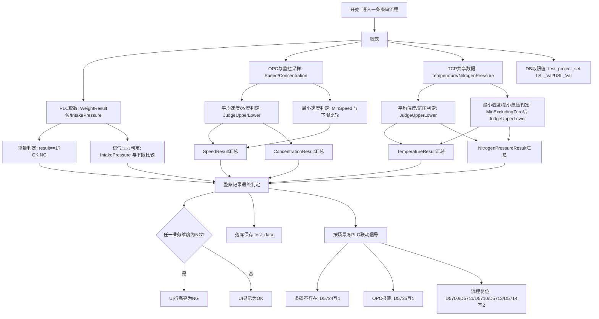

# 判定业务说明

## 1. 判定维度数量

按你确认的口径，当前系统使用 10 个细分子维度进行判定。

1. 重量结果 `WeightResult`（重量判定）
2. 平均温度结果 `AverageTemperatureResult`（平均温度判定）
3. 最小温度结果 `MinTemperatureResult`（最小温度判定，使用排除 0 后的最小值）
4. 平均氮气压力结果 `AverageNitrogenPressureResult`（平均氮气压力判定）
5. 最小氮气压力结果 `MinNitrogenPressureResult`（最小氮气压力判定，使用排除 0 后的最小值）
6. 进气压力结果 `IntakePressureResult`（进气压力判定，仅判下限）
7. 平均速度结果 `AverageSpeedResult`（平均速度判定）
8. 最小速度结果 `MinSpeedResult`（最小速度判定）
9. 平均浓度结果 `AverageConcentrationResult`（平均浓度判定）
10. 浓度汇总结果 `ConcentrationResult`（浓度汇总判定）

说明：界面整条记录是否标记为 NG，实际按 6 个业务汇总维度展示。

1. 重量 `WeightResult`（重量判定，来自 PLC 结果位）
2. 温度 `TemperatureResult`（由平均与最小温度汇总得出）
3. 氮气压力 `NitrogenPressureResult`（由平均与最小氮气压力汇总得出）
4. 进气压力 `IntakePressureResult`（进气压力判定，仅判下限）
5. 速度 `SpeedResult`（由平均与最小速度汇总得出）
6. 浓度 `ConcentrationResult`（浓度汇总判定）

只要以上任一业务维度为 NG，该条数据在实时表和历史表都会高亮为 NG。

## 2. 通用判定函数

监控类维度复用统一函数 `JudgeUpperLower(result, upperLimit, lowerLimit, msg)`。

规则如下（注意：`upperLimit` / `lowerLimit` 的具体值来源见下文）：

1. 当 `upperLimit == 0` 时，仅判下限：
- `result < lowerLimit` -> NG
- `result >= lowerLimit` -> OK

2. 当 `upperLimit != 0` 时，判上下限：
- `result > upperLimit` -> NG
- `result < lowerLimit` -> NG
- `lowerLimit <= result <= upperLimit` -> OK

来源说明：
- 一般监控维度的上下限由数据库加载（表 `test_project_set` 中的 `LSL_Val` / `USL_Val`，通过 `ProjectCode` 映射到运行时变量，如 `AverageTemperatureLowerLimit` / `AverageTemperatureUpperLimit`）。
- 少数与称重直接相关的限值（如称重上限/下限、沉积重量等）是从 PLC 对应地址读取并保存（参见 7.1 的 PLC 地址表，如称重1 的重量上限/下限在 D5508 / D5510）。

### 2.1 判定业务流程图



## 3. 各维度 OK/NG 规则

### 3.1 重量结果 WeightResult
来源：由 PLC 结果位直接映射（称重1 与 称重2 两组地址）。文档同时列出 PLC 原始值的含义注释与上位机实际代码映射行为。

| 称重工位 | PLC 地址 | PLC 值 | 代码/上位机字段 | 对应判定 / 说明 |
| --- | ---: | :---: | --- | --- |
| 称重1 | D5512 | 0 | `WeightResult` | 按注释为“待检测(Pending)”，但代码中 `result==1?"OK":"NG"` 会将 0 视作 NG（见源码） |
| 称重1 | D5512 | 1 | `WeightResult` | PLC=1 -> `WeightResult = "OK"`（上位机判定 OK） |
| 称重1 | D5512 | 2 | `WeightResult` | PLC=2 -> `WeightResult = "NG"`（上位机判定 NG） |
| 称重2 | D5976 | 0 | `WeightResult`（Location=B） | 注释为待检测；实际代码同样只把 1 视为 OK，其他值视为 NG |
| 称重2 | D5976 | 1 | `WeightResult`（Location=B） | PLC=1 -> `WeightResult = "OK"` |
| 称重2 | D5976 | 2 | `WeightResult`（Location=B） | PLC=2 -> `WeightResult = "NG"` |

代码参考：在 `Inkjet_Print_View/Moudules/MecPlcHelper.cs` 的 `GetTestData` / `GetTestData2` 中，存在如下映射：

```csharp
testData.WeightResult = result == 1 ? "OK" : "NG";
```

因此实际行为总结：只有 PLC 原始值等于 `1` 时，上位机会写入 `"OK"`，其余值（包括 `0` 注释中的“待检测”）都会被记录为 `"NG"`。如果想保留 `0` 为“待检测”状态，需要在代码中改为显式处理 `0` 的分支。

备注：重量上限、下限、沉积重量（D5508/D5510/D5506 等）会被读取并保存，但主程序中没有再使用 `JudgeUpperLower` 对沉积重量做二次判定（重量结果以 PLC 给出的位为准）。

### 3.2 平均温度结果 `AverageTemperatureResult`（平均温度判定）

| 字段 | 输入值 | 限值来源 | 判定条件 | 判定结果 |
| --- | --- | --- | --- | --- |
| `AverageTemperatureResult` | `AverageTemperature`（平均温度） | `AverageTemperatureLowerLimit` / `AverageTemperatureUpperLimit`，来自数据库 `test_project_set` 的 `LSL_Val` / `USL_Val`（`ProjectCode=AverageTemperature` 映射） | `AverageTemperatureLowerLimit <= AverageTemperature <= AverageTemperatureUpperLimit` | OK |
| `AverageTemperatureResult` | `AverageTemperature`（平均温度） | 同上 | `AverageTemperature < AverageTemperatureLowerLimit` 或 `AverageTemperature > AverageTemperatureUpperLimit` | NG |

### 3.3 最小温度结果 `MinTemperatureResult`（最小温度判定）

| 字段 | 输入值 | 计算方式 | 限值来源 | 判定条件 | 判定结果 |
| --- | --- | --- | --- | --- | --- |
| `MinTemperatureResult` | `MinTemperature`（最小温度） | `MinExcludingZero`（排除 0 后取最小值） | `MinTemperatureLowerLimit`，来自数据库 `test_project_set.LSL_Val`（`ProjectCode=MinTemperature`） | `MinTemperature >= MinTemperatureLowerLimit` | OK |
| `MinTemperatureResult` | `MinTemperature`（最小温度） | 同上 | 同上 | `MinTemperature < MinTemperatureLowerLimit` | NG |

### 3.4 温度汇总 TemperatureResult

| 字段 | 汇总输入 | 汇总规则 | 汇总结果 |
| --- | --- | --- | --- |
| `TemperatureResult` | `AverageTemperatureResult` + `MinTemperatureResult` | 两者均为 OK | OK |
| `TemperatureResult` | `AverageTemperatureResult` + `MinTemperatureResult` | 其它任意组合 | NG |

### 3.5 平均氮气压力结果 `AverageNitrogenPressureResult`（平均氮气压力判定）

| 字段 | 输入值 | 限值来源 | 判定条件 | 判定结果 |
| --- | --- | --- | --- | --- |
| `AverageNitrogenPressureResult` | `AverageNitrogenPressure`（平均氮气压力） | `AverageNitrogenPressureLowerLimit` / `AverageNitrogenPressureUpperLimit`，来自数据库 `test_project_set` 的 `LSL_Val` / `USL_Val`（`ProjectCode=AverageNitrogenPressure`） | `AverageNitrogenPressureLowerLimit <= AverageNitrogenPressure <= AverageNitrogenPressureUpperLimit` | OK |
| `AverageNitrogenPressureResult` | `AverageNitrogenPressure`（平均氮气压力） | 同上 | `AverageNitrogenPressure < AverageNitrogenPressureLowerLimit` 或 `AverageNitrogenPressure > AverageNitrogenPressureUpperLimit` | NG |

### 3.6 最小氮气压力结果 `MinNitrogenPressureResult`（最小氮气压力判定）

| 字段 | 输入值 | 计算方式 | 限值来源 | 判定条件 | 判定结果 |
| --- | --- | --- | --- | --- | --- |
| `MinNitrogenPressureResult` | `MinNitrogenPressure`（最小氮气压力） | `MinExcludingZero`（排除 0 后取最小值） | `MinNitrogenPressureLowerLimit`，来自数据库 `test_project_set.LSL_Val`（`ProjectCode=MinNitrogenPressure`） | `MinNitrogenPressure >= MinNitrogenPressureLowerLimit` | OK |
| `MinNitrogenPressureResult` | `MinNitrogenPressure`（最小氮气压力） | 同上 | 同上 | `MinNitrogenPressure < MinNitrogenPressureLowerLimit` | NG |

### 3.7 氮气压力汇总 NitrogenPressureResult

| 字段 | 汇总输入 | 汇总规则 | 汇总结果 |
| --- | --- | --- | --- |
| `NitrogenPressureResult` | `AverageNitrogenPressureResult` + `MinNitrogenPressureResult` | 两者均为 OK | OK |
| `NitrogenPressureResult` | `AverageNitrogenPressureResult` + `MinNitrogenPressureResult` | 其它任意组合 | NG |

### 3.8 进气压力结果 `IntakePressureResult`（进气压力判定）

| 字段 | 输入值来源 | 限值来源 | 判定条件 | 判定结果 |
| --- | --- | --- | --- | --- |
| `IntakePressureResult` | `IntakePressure`（PLC 地址 `D5518`） | `IntakePressureLowerLimit`，来自数据库 `test_project_set.LSL_Val`（`ProjectCode=IntakePressure`） | `IntakePressure >= IntakePressureLowerLimit` | OK |
| `IntakePressureResult` | `IntakePressure`（PLC 地址 `D5518`） | 同上 | `IntakePressure < IntakePressureLowerLimit` | NG |

### 3.9 平均速度结果 `AverageSpeedResult`（平均速度判定）

| 字段 | 输入值 | 限值来源 | 判定条件 | 判定结果 |
| --- | --- | --- | --- | --- |
| `AverageSpeedResult` | `AverageSpeed`（平均速度） | `AverageSpeedLowerLimit` / `AverageSpeedUpperLimit`，来自数据库 `test_project_set` 的 `LSL_Val` / `USL_Val`（`ProjectCode=AverageSpeed`） | `AverageSpeedLowerLimit <= AverageSpeed <= AverageSpeedUpperLimit` | OK |
| `AverageSpeedResult` | `AverageSpeed`（平均速度） | 同上 | `AverageSpeed < AverageSpeedLowerLimit` 或 `AverageSpeed > AverageSpeedUpperLimit` | NG |

### 3.10 最小速度结果 `MinSpeedResult`（最小速度判定）

| 字段 | 输入值 | 限值来源 | 判定条件 | 判定结果 |
| --- | --- | --- | --- | --- |
| `MinSpeedResult` | `MinSpeed`（最小速度） | `MinSpeedLowerLimit`，来自数据库 `test_project_set.LSL_Val`（`ProjectCode=MinSpeed`） | `MinSpeed >= MinSpeedLowerLimit` | OK |
| `MinSpeedResult` | `MinSpeed`（最小速度） | 同上 | `MinSpeed < MinSpeedLowerLimit` | NG |

### 3.11 速度汇总 SpeedResult

| 字段 | 汇总输入 | 汇总规则 | 汇总结果 |
| --- | --- | --- | --- |
| `SpeedResult` | `AverageSpeedResult` + `MinSpeedResult` | 两者均为 OK | OK |
| `SpeedResult` | `AverageSpeedResult` + `MinSpeedResult` | 其它任意组合 | NG |

### 3.12 平均浓度结果 `AverageConcentrationResult`（平均浓度判定）

| 字段 | 输入值 | 限值来源 | 判定条件 | 判定结果 |
| --- | --- | --- | --- | --- |
| `AverageConcentrationResult` | `AverageConcentration`（平均浓度） | `AverageConcentrationLowerLimit` / `AverageConcentrationUpperLimit`，来自数据库 `test_project_set` 的 `LSL_Val` / `USL_Val`（`ProjectCode=AverageConcentration`） | `AverageConcentrationLowerLimit <= AverageConcentration <= AverageConcentrationUpperLimit` | OK |
| `AverageConcentrationResult` | `AverageConcentration`（平均浓度） | 同上 | `AverageConcentration < AverageConcentrationLowerLimit` 或 `AverageConcentration > AverageConcentrationUpperLimit` | NG |

### 3.13 浓度汇总 ConcentrationResult

| 字段 | 汇总输入 | 汇总规则 | 汇总结果 |
| --- | --- | --- | --- |
| `ConcentrationResult` | `AverageConcentrationResult` | `AverageConcentrationResult == OK` | OK |
| `ConcentrationResult` | `AverageConcentrationResult` | 其它 | NG |

### 字段来源与判定流程（逐字段）

下面按每个参与判定的字段，列出：来源、计算/处理步骤、判定规则（OK / NG / 未判定）。这样便于现场人员一眼看出该字段从哪里取数、如何计算、最终与哪个限值比较。

- 字段：`WeightResult`（重量结果）

| 字段 | 来源 | 计算/处理 | 判定 / 说明 |
| --- | --- | --- | --- |
| `WeightResult` | PLC 结果位：称重1 D5512 / 称重2 D5976 | 直接读取 PLC 位；上位机映射 `result == 1 ? "OK" : "NG"`（见 `Inkjet_Print_View/Moudules/MecPlcHelper.cs`） | PLC=1 -> OK；PLC=2 -> NG；PLC=0 注释为“待检测(Pending)”（未判定），但当前代码视为 NG；如需未判定，需修改代码显式处理 0 |

- 字段：`AverageTemperature`（平均温度）

| 字段 | 来源 | 计算/处理 | 判定 / 说明 |
| --- | --- | --- | --- |
| `AverageTemperature` | OPC UA 监控采样 | 对监控时间窗口内的有效采样取算术平均 | 使用[`AverageTemperatureLowerLimit`（来自 DB `test_project_set.LSL_Val`，经 `ProjectCode` 映射） , `AverageTemperatureUpperLimit`（来自 DB `test_project_set.USL_Val`）] 与 `JudgeUpperLower` 比较：区间内 -> OK；越界 -> NG；样本不足 -> 未判定 |

- 字段：`MinTemperature`（最小温度）

| 字段 | 来源 | 计算/处理 | 判定 / 说明 |
| --- | --- | --- | --- |
| `MinTemperature` | OPC UA 监控采样 | 使用 `MinExcludingZero`（排除 0 后取最小值） | 与 `MinTemperatureLowerLimit`（来自 DB `test_project_set.LSL_Val`）比较：>= 下限 -> OK；< 下限 -> NG；无非零样本 -> 未判定 |

- 字段：`TemperatureResult`（温度汇总）

| 字段 | 来源 | 计算/处理 | 判定 / 说明 |
| --- | --- | --- | --- |
| `TemperatureResult` | `AverageTemperatureResult` + `MinTemperatureResult` | 汇总两者：两者均 OK -> OK；任一 NG -> NG；任一未判定且另一为 OK -> 未判定 | 用于 UI 汇总与行高亮判断 |

- 字段：`AverageNitrogenPressure`（平均氮气压力）

| 字段 | 来源 | 计算/处理 | 判定 / 说明 |
| --- | --- | --- | --- |
| `AverageNitrogenPressure` | OPC UA 监控采样 | 时间窗口内有效样本平均 | 与 [`AverageNitrogenPressureLowerLimit`（DB LSL） , `AverageNitrogenPressureUpperLimit`（DB USL）] 比较：区间内 -> OK；越界 -> NG；样本不足 -> 未判定 |

- 字段：`MinNitrogenPressure`（最小氮气压力）

| 字段 | 来源 | 计算/处理 | 判定 / 说明 |
| --- | --- | --- | --- |
| `MinNitrogenPressure` | OPC UA 监控采样 | `MinExcludingZero` | 与 `MinNitrogenPressureLowerLimit`（DB LSL）比较：>= 下限 -> OK；< 下限 -> NG；无非零样本 -> 未判定 |

- 字段：`NitrogenPressureResult`（氮气压力汇总）

| 字段 | 来源 | 计算/处理 | 判定 / 说明 |
| --- | --- | --- | --- |
| `NitrogenPressureResult` | `AverageNitrogenPressureResult` + `MinNitrogenPressureResult` | 汇总：两者均 OK -> OK；任一 NG -> NG；任一未判定且另一为 OK -> 未判定 | 用于 UI 汇总与行高亮判断 |

- 字段：`IntakePressure`（进气压力）

| 字段 | 来源 | 计算/处理 | 判定 / 说明 |
| --- | --- | --- | --- |
| `IntakePressure` | PLC: D5518 | 直接读取浮点值（PLC/传感器） | 与 `IntakePressureLowerLimit`（DB LSL）比较：>= 下限 -> OK；< 下限 -> NG；读取失败或无值 -> 未判定 |

- 字段：`AverageSpeed`（平均速度）

| 字段 | 来源 | 计算/处理 | 判定 / 说明 |
| --- | --- | --- | --- |
| `AverageSpeed` | OPC UA 监控采样 | 监控窗口内有效样本平均 | 与 [`AverageSpeedLowerLimit`（DB LSL）, `AverageSpeedUpperLimit`（DB USL）] 比较：区间内 -> OK；越界 -> NG；样本不足 -> 未判定 |

- 字段：`MinSpeed`（最小速度）

| 字段 | 来源 | 计算/处理 | 判定 / 说明 |
| --- | --- | --- | --- |
| `MinSpeed` | OPC UA 监控采样 | 排除 0 后取最小值（MinExcludingZero）；若只有 0 或无样本 -> 未判定 | 与 `MinSpeedLowerLimit`（DB LSL）比较：>= 下限 -> OK；< 下限 -> NG；样本不足 -> 未判定 |

- 字段：`SpeedResult`（速度汇总）

| 字段 | 来源 | 计算/处理 | 判定 / 说明 |
| --- | --- | --- | --- |
| `SpeedResult` | `AverageSpeedResult` + `MinSpeedResult` | 汇总：两者均 OK -> OK；任一 NG -> NG；任一未判定且另一为 OK -> 未判定 | 用于 UI 汇总与行高亮判断 |

- 字段：`AverageConcentration`（平均浓度）

| 字段 | 来源 | 计算/处理 | 判定 / 说明 |
| --- | --- | --- | --- |
| `AverageConcentration` | OPC UA 监控采样 / 监控设备 | 监控窗口内有效样本平均 | 与 [`AverageConcentrationLowerLimit`（DB LSL）, `AverageConcentrationUpperLimit`（DB USL）] 比较：区间内 -> OK；越界 -> NG；样本不足 -> 未判定 |

- 字段：`ConcentrationResult`（浓度汇总）

| 字段 | 来源 | 计算/处理 | 判定 / 说明 |
| --- | --- | --- | --- |
| `ConcentrationResult` | `AverageConcentrationResult` | 直接由平均浓度结果决定 | `AverageConcentrationResult` = OK -> OK；其他 -> NG；若 Average 未判定 -> 未判定 |

说明：所有“来自参数设置”的上下限值均通过 `ProjectCode` 映射并从数据库表 `test_project_set` 的 `LSL_Val` / `USL_Val` 等字段加载，代码中通过映射加载到运行时阈值（详见 [Inkjet_Print_View/FrmMain.cs](Inkjet_Print_View/FrmMain.cs) 的限值加载与 `JudgeUpperLower` 实现）。

源码参考：判定函数位于 [Inkjet_Print_View/FrmMain.cs](Inkjet_Print_View/FrmMain.cs)，重量位映射在 [Inkjet_Print_View/Moudules/MecPlcHelper.cs](Inkjet_Print_View/Moudules/MecPlcHelper.cs)，判定字段模型见 [PR_Model/TestData.cs](PR_Model/TestData.cs)。

### PLC 直接判定与判定后写回示例

下面列出两类常见场景：一类是 PLC 直接驱动判定（PLC 读到特定值即决定字段结果）；另一类是上位机判定后写回 PLC（判定结果触发 PLC 写入以做联动）。表中只示例已在文档或代码中出现的地址与常用写地址，实际映射请以 PLC 端与代码配置为准。

| 场景 | PLC 地址 | 触发值 / 读写 | 行为（示例） | 代码位置/说明 |
| --- | ---: | --- | --- | --- |
| PLC 直接判定（示例） | D5512 / D5976 | 1 | PLC=1 -> `WeightResult` = OK（其它值视为 NG，0 在注释为 Pending 但当前代码视为 NG） | `Inkjet_Print_View/Moudules/MecPlcHelper.cs`（读取并映射） |
| PLC 直接判定（示例） | D5518 | float 值 | PLC 直接提供 `IntakePressure` 输入，上位机按下限判定 | 在监控采集/OPC 或 PLC 读处理处 |

| 判定后写回 PLC（示例） | D5723 | 写 1 | 当上位机判定出现监控异常时，写入 `D5723=1` 触发 PLC 异常联动（示例） | 见 `FrmMain.cs` 异常处理处（或联动函数） |
| 判定后写回 PLC（示例） | D5724 | 写 1 | 条码不存在或数据库校验失败时，写 `D5724=1` | 文档 7.2 条目：条码不存在 |
| 判定后写回 PLC（示例） | D5725 | 写 1 | OPC UA 报警联动时写入 `D5725=1` | 文档 7.2 条目：OPC 报警联动 |
| 判定后写回 PLC（示例） | D5700 / D5711 / D5710 / D5713 / D5714 | 写 2（复位） | 流程完成或复位时上位机写入 2 到对应地址以清除流程就绪/复位标志 | 文档 7.2 条目：复位信号 |

说明：
- 上位机 → PLC 的写入通常用于：异常联动、流程复位、报警置位等。上表列出的写地址均在文档 7.1/7.2 中已有说明。
- 如果需要为某个判定字段添加专门的 PLC 写回（例如：TemperatureResult=NG 时写入特定地址），建议在 PLC 与上位机接口规范中明确地址并在代码中实现对应写操作（在 `FrmMain.cs` 或专门的联动模块中）。
- 在实现写回时要注意写值语义（写 1 表示置位、写 2 表示复位等），这些语义由 PLC 端约定，务必与 PLC 工程师确认后再在代码中使用。


## 4. 一条数据在什么情况下 NG / OK

下面给出同一条码数据的多场景判定模板。

### 4.1 样例数据基础字段

- Code: SN20260407001
- WeightResult: OK
- AverageTemperature: 320, AverageTemperatureLowerLimit: 300, AverageTemperatureUpperLimit: 350
- MinTemperature: 310, MinTemperatureLowerLimit: 300
- AverageNitrogenPressure: 340, AverageNitrogenPressureLowerLimit: 300, AverageNitrogenPressureUpperLimit: 380
- MinNitrogenPressure: 320, MinNitrogenPressureLowerLimit: 300
- IntakePressure: 2.30, IntakePressureLowerLimit: 2.15
- AverageSpeed: 520, AverageSpeedLowerLimit: 450, AverageSpeedUpperLimit: 600
- MinSpeed: 480, MinSpeedLowerLimit: 450
- AverageConcentration: 8.5, AverageConcentrationLowerLimit: 7.0, AverageConcentrationUpperLimit: 10.0

### 4.2 场景 A: 全部 OK

当以上字段都满足限值条件时：

1. 10 个子维度全部 OK
2. 6 个业务汇总维度全部 OK
3. UI 不标粉色

### 4.3 场景 B: 单维 NG

仅把 MinSpeed 调整为 430，其它不变：

1. MinSpeedResult = NG
2. SpeedResult = NG
3. 其余维度仍可为 OK
4. 最终整条记录判为 NG 并高亮

### 4.4 场景 C: 多维 NG

将 IntakePressure 调整为 2.00，AverageTemperature 调整为 360：

1. IntakePressureResult = NG
2. AverageTemperatureResult = NG，进而 TemperatureResult = NG
3. 最终整条记录判为 NG 并高亮

### 4.5 场景 D: 上限为 0 的特殊情况

以 MinSpeedResult 这类 only lower limit 的判定为例：

1. upperLimit 传入 0，仅比较 lowerLimit
2. 不会出现“高于上限 NG”分支

## 5. 规则边界与注意事项

1. MinTemperature 和 MinNitrogenPressure 使用 MinExcludingZero，0 值会被排除后再求最小值。
2. 进气压力 IntakePressure 当前仅判下限，不判上限。
3. 重量 WeightResult 由 PLC 结果位决定，而不是在上位机用上下限再次计算。
4. UtilizationRate 银粉利用率在当前版本用于记录和显示，不参与 UI 的 NG 高亮判定。

## 6. 源码索引

1. 监控维度判定与业务汇总：Inkjet_Print_View/FrmMain.cs
2. 进气压力判定：Inkjet_Print_View/FrmMain.cs
3. 通用上下限函数 JudgeUpperLower：Inkjet_Print_View/FrmMain.cs
4. UI 整条 NG 高亮规则：Inkjet_Print_View/FrmMain.cs
5. 重量结果映射 WeightResult = result==1 ? OK : NG：Inkjet_Print_View/Moudules/MecPlcHelper.cs
6. 判定字段模型定义：PR_Model/TestData.cs

## 7. PLC 地址对照表

说明：本表优先列出和判定结果、流程握手、异常联动直接相关的地址。监控均值类数据来自 OPC UA 采样统计，不直接由 PLC 地址提供。

### 7.1 判定相关输入与结果

| 类别 | 变量/信号 | PLC 地址 | 读写 | 说明 |
| --- | --- | --- | --- | --- |
| 称重1 | 读取准备好 | D5500 | 读 | 称重1流程触发信号 |
| 称重1 | 条码 | D5520 (49字) | 读 | 称重二维码 |
| 称重1 | 喷前重量 | D5502 | 读 | float |
| 称重1 | 喷后重量 | D5504 | 读 | float |
| 称重1 | 沉积重量 | D5506 | 读 | float，程序中取绝对值并四舍五入 |
| 称重1 | 重量上限 | D5508 | 读 | float |
| 称重1 | 重量下限 | D5510 | 读 | float |
| 称重1 | 重量结果位 | D5512 | 读 | 1=OK，其它=NG |
| 进气 | 进气压力 | D5518 | 读 | IntakePressure 判定输入 |
| 冷喷 | 供粉速度 | D5677 | 读 | 利用率计算输入 |
| 冷喷 | 喷嘴高度 | D5678 | 读 | 记录字段 |
| 冷喷 | 进气流量 | D5696 | 读 | 记录字段 |
| 冷喷 | 准备好信号 | D5670 | 读 | 冷喷流程开始/结束握手 |
| 监控 | 准备好信号 | D5671 | 读 | 监控流程开始/结束握手 |
| 监控 | 条码 | D5620 (49字) | 读 | 监控二维码 |
| 称重2 | 读取准备好 | D5699 | 读 | 称重2流程触发信号 |
| 称重2 | 条码 | D5935 (34字) | 读 | 称重2二维码 |
| 称重2 | 喷前重量 | D5970 | 读 | float |
| 称重2 | 喷后重量 | D5972 | 读 | float |
| 称重2 | 沉积重量 | D5974 | 读 | float |
| 称重2 | 重量结果位 | D5976 | 读 | 1=OK，其它=NG |

### 7.2 流程复位与异常联动

| 类别 | 信号 | PLC 地址 | 读写 | 说明 |
| --- | --- | --- | --- | --- |
| 称重1复位 | ResetReady | D5700 | 写(2) | 称重1完成后复位 |
| 监控复位 | ResetMonitorReady | D5711 | 写(2) | 监控完成后复位 |
| 冷喷复位 | ResetColdSprayReady | D5710 / D5713 | 写(2) | 冷喷工位1/2复位 |
| 称重2复位 | ResetReady2 | D5714 | 写(2) | 称重2完成后复位 |
| 异常复位状态 | ResetAbnormal | D5674 | 读 | PLC 异常状态复位判定 |
| 冷喷参数异常 | WriteColdSpray | D5721 | 写 | 异常联动信号 |
| 超时异常1 | WriteOverTime | D5712 | 写 | 清洗摆放超时 |
| 超时异常2 | WriteOverTime2 | D5713 | 写 | 清洗摆放超时 |
| 监控异常 | WriteMonitoringAbnormality | D5723 | 写 | 监控异常联动 |
| 条码不存在 | WriteNotCode | D5724 | 写 | 数据库中无该条码 |
| OPC 报警联动 | WriteOpcUaAlarmFlag | D5725 | 写 | OPC UA 报警置位 |

### 7.3 心跳与运行状态

| 信号 | PLC 地址 | 读写 | 说明 |
| --- | --- | --- | --- |
| 上位机心跳写入 | D5750 | 写 | 程序运行写1，关闭写0 |
| 上位机心跳镜像 | D5501.0 | 读 | 上位机心跳位读取 |
| PLC 心跳读取 | D5673 | 读 | 上位机读取 PLC 心跳 |
| PLC 心跳复位 | D7139 | 写(0) | PLC 心跳复位 |

### 7.4 判定限值来源说明

1. 温度、氮气压力、进气压力、速度、浓度 等监控类判定限值由数据库测试项目参数加载：表 `test_project_set` 中的 `LSL_Val`（下限）与 `USL_Val`（上限），运行时通过 `ProjectCode` 映射到对应的变量名（例如 `AverageTemperatureLowerLimit` / `AverageTemperatureUpperLimit`）。
2. 由于重量/称重相关的限值特殊：称重的上限/下限、沉积重量等会从 PLC 对应寄存器读取并保存（参见 7.1 表中称重相关地址，如 D5508、D5510 等）；这些 PLC 值部分在界面上显示并可用于记录，但主程序当前并未对沉积重量执行 `JudgeUpperLower` 二次判定（重量判定以 PLC 结果位为准）。
3. 代码加载限值的实现位置：见 [Inkjet_Print_View/FrmMain.cs](Inkjet_Print_View/FrmMain.cs) 的限值加载与 `JudgeUpperLower` 实现。

## 8. 现场调试检查清单

### 8.1 开机与连接检查

1. PLC、冷喷枪、清洗机连接全部成功。
2. 上位机心跳 D5750 能写入，PLC 心跳 D5673 有变化。
3. OPC UA 连接成功，监控订阅已建立。

### 8.2 单条码全流程检查

1. 冷喷开始时 D5670 从待机变为准备态，条码从 D5570 读取正确。
2. 冷喷结束后写入 SESSION STORE，日志有确认成功记录。
3. 监控开始时 D5671 进入准备态，条码从 D5620 匹配同一条码。
4. 监控完成后温度、压力、速度、浓度结果均已写入数据库。
5. 称重开始时 D5500 触发，条码从 D5520 读取正确。
6. 称重完成后重量结果位 D5512 与界面 WeightResult 一致。

### 8.3 判定逻辑现场核对

1. 将某一维度调到低于下限，确认该维度结果变 NG。
2. 将该维度恢复到限值区间，确认结果恢复 OK。
3. 任意一个业务维度为 NG 时，实时表该行应高亮。
4. 历史表同一条数据应保持 NG 高亮一致。

### 8.4 异常联动检查

1. 使用不存在条码，确认 D5724 被置位，且系统日志有明确报错。
2. 触发 OPC UA 报警，确认 D5725 置位。
3. 触发监控异常流程，确认 D5723 写入。
4. 异常解除后执行复位，确认 D5674 状态恢复。

### 8.5 复位与收尾检查

1. 称重完成后 D5700 写入 2。
2. 监控完成后 D5711 写入 2。
3. 冷喷工位复位 D5710 或 D5713 写入 2。
4. 称重2流程完成后 D5714 写入 2。

### 8.6 常见故障快速定位

1. 现象：重量结果长期 NG。
定位：先看 D5512 或 D5976 原始结果位，再核对称重上下限与称重原始值。

2. 现象：进气压力频繁 NG。
定位：核对 D5518 实时值与 IntakePressureLowerLimit 参数是否匹配。

3. 现象：监控维度全为 0 或不更新。
定位：检查 OPC UA 订阅状态与 D5671 握手是否完成。

4. 现象：异常不能自动恢复。
定位：检查 D5674 复位状态、D5700/D5711/D5710/D5714 是否已按流程写入 2。
